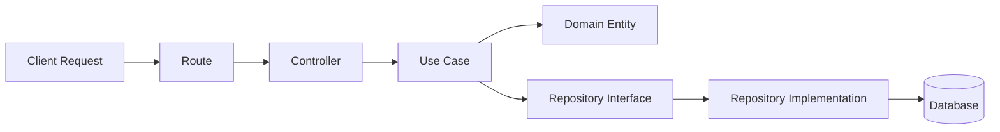

# ACE Platform - Folder Structure Guide

This document provides a detailed breakdown of every folder and its purpose in the ACE Platform.

## Table of Contents
- [Root Structure](#root-structure)
- [Frontend Structure](#frontend-structure)
- [Backend Structure](#backend-structure)

---

## Root Structure

```
ACE-Tool/
├── docs/                 # 📚 All documentation
├── frontend/             # ⚛️ React application
├── backend/              # 🚀 Fastify API server
├── package.json          # Root workspace configuration
├── .gitignore           # Git exclusions
├── .editorconfig        # Code style settings
└── README.md            # Project overview
```

### Purpose
- **Monorepo**: Keeps frontend and backend together for easier development
- **Shared tooling**: Linting, formatting, and dependency management at root level

---

## Frontend Structure

### `/frontend/src/app/`
**Application-wide setup**: routing, providers, global state

- `routes/` - React Router configuration
- `store/` - State management (e.g., Zustand/Context)
- `providers/` - Context wrappers (Auth, Theme)

### `/frontend/src/components/`
**Reusable UI components** for the entire app

- `ui/` - Atomic elements: Button, Input, Card, Badge
- `layout/` - Structural: Sidebar, Header, Footer
- `logic/` - Functional: ErrorBoundary, ProtectedRoute

> ⚠️ **Rule**: Only shared components here. Feature-specific components go in `features/`.

### `/frontend/src/features/`
**Business logic modules** (Vertical Slices)

Each feature is self-contained:
```
features/
└── auth/
    ├── components/   # LoginForm, RegisterForm
    ├── hooks/        # useLogin, useAuth
    ├── api/          # loginAPI, registerAPI
    ├── routes/       # /login, /register
    └── index.js      # Public exports
```

**Why?** Changes to authentication are isolated to one folder.

### `/frontend/src/lib/`
**Third-party library abstractions**

- `axios.js` - API client setup (interceptors, base URL)
- `utils.js` - Helper functions (classNames merger, formatters)

**Why?** If we replace Axios with Fetch, we only change `lib/axios.js`.

### `/frontend/src/hooks/`
**Shared custom hooks**

Examples: `useDebounce`, `useLocalStorage`, `useOnClickOutside`

### `/frontend/src/services/`
**External integrations**

Examples: Analytics, Firebase, Payment gateways

---

## Backend Structure

### `/backend/src/domain/` (Layer 1 - Core)
**Pure business logic**. No frameworks, no database.

```
domain/
├── errors/          # DomainError, ValidationError
└── user/
    ├── User.js      # Entity: business rules for User
    ├── UserRepository.js  # Interface (contract)
    └── UserValueObjects.js # Email, Password objects
```

**Dependency Rule**: Domain depends on NOTHING.

### `/backend/src/application/` (Layer 2 - Use Cases)
**Orchestrates domain logic**

```
application/
└── user/
    ├── CreateUser.js  # Use Case implementation
    ├── GetUser.js
    └── dtos/          # Input/Output data structures
```

**Why?** Use Cases are testable without HTTP or DB.

### `/backend/src/infrastructure/` (Layer 3 - Details)
**Implements domain interfaces** using real frameworks

```
infrastructure/
├── database/
│   ├── mongoose/
│   │   ├── models/       # Mongoose Schemas
│   │   └── repositories/ # Implements UserRepository
│   └── connection.js
├── logger/              # Pino logger setup
└── server/              # Fastify plugins
```

**Why?** You can swap MongoDB for PostgreSQL here without touching Domain.

### `/backend/src/presentation/` (Layer 4 - API)
**HTTP layer**

```
presentation/
└── http/
    ├── routes/        # Route definitions
    ├── controllers/   # Call Use Cases, return responses
    └── middlewares/   # Auth, validation
```

**Flow**: Request → Route → Controller → Use Case → Domain

### `/backend/src/config/`
Environment variables and configurations

### `/backend/src/shared/`
Cross-layer utilities (constants, helpers)

---

## Visual Flow



---

## Team Guidelines

1. **Keep features isolated**: All auth logic stays in `features/auth/`
2. **Respect layer boundaries**: Domain should never import from Infrastructure
3. **Use indexes for exports**: Always export via `index.js` for clean imports
4. **Document complex logic**: Add JSDoc comments for non-obvious code

---

For architectural reasoning, see [architecture.md](./architecture.md).
